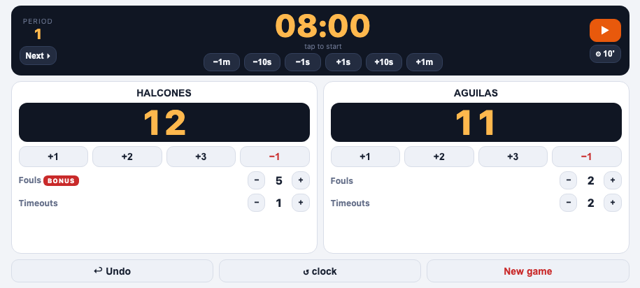

# Tablero Basketball

App Android para controlar el marcador de un partido de basketball desde la cancha: puntaje, reloj por cuartos, faltas de equipo con indicador de bonus, tiempos muertos y deshacer — todo pensado para operarse con una mano durante el partido.



## Funciones

- **Marcador** por equipo con +1/+2/+3/−1, y nombre de equipo editable.
- **Reloj por cuartos** con inicio/pausa y ajuste fino: ±1s, ±10s y ±1 minuto.
- **Faltas de equipo** con indicador de **BONUS** automático a partir de la 5ª falta del cuarto.
- **Tiempos muertos** por equipo.
- **Deshacer** la última acción (hasta 60 pasos atrás).
- **Duración del cuarto configurable** (8', 10' FIBA, 12' NBA o un valor propio); las prórrogas duran 5 minutos.
- **Chicharra** de fin de período (sonido + vibración) al llegar a 00:00.
- **Pantalla siempre encendida** mientras el reloj está corriendo.
- **Se guarda solo**: si cierras la app a mitad de partido, al volver a abrirla todo sigue como lo dejaste (el reloj queda pausado).
- **5 idiomas** (español, inglés, alemán, francés, portugués), con detección automática del idioma del teléfono en el primer arranque y selector manual en el modal de configuración.

## Tecnología

[Vue 3](https://vuejs.org/) + [Vite](https://vite.dev/), empaquetado como app Android con [Capacitor](https://capacitorjs.com/) e internacionalizado con [vue-i18n](https://vue-i18n.intlify.dev/).

## Requisitos

- Node.js 20+ y npm.
- [Android Studio](https://developer.android.com/studio) con un SDK de Android instalado, para compilar y correr la app.

## Empezar

```bash
npm install
npm run dev
```

Esto levanta un servidor de desarrollo web en el navegador — útil para iterar rápido en la interfaz, pero sin los plugins nativos reales (esos solo corren dentro de la app Android).

## Compilar y correr en Android

```bash
npm run build            # build de producción
npx cap sync android       # copiarlo al proyecto Android nativo
npx cap open android         # abrir en Android Studio
```

Desde Android Studio, conecta un teléfono por USB (con depuración USB activada) o usa un emulador, y corre la app con el botón ▶. También se puede instalar directo por línea de comandos con `npx cap run android`.

Los detalles de convenciones del código, comandos y cómo probar en un dispositivo físico están en [CLAUDE.md](CLAUDE.md).

## Prototipo original

La app partió de [`docs/prototype.html`](docs/prototype.html), un prototipo funcional de un solo archivo HTML — se conserva como referencia de diseño y comportamiento.
